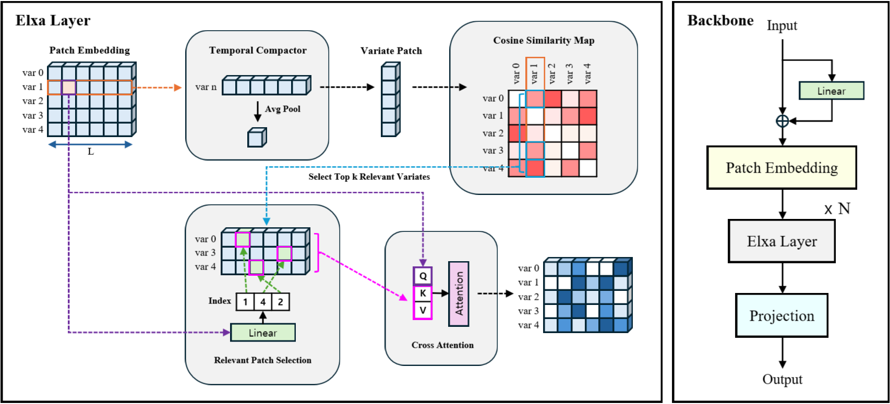

# ElxaTST

> **E**fficient **L**ead-lag Cross(**X**) **A**ttention **T**ime **S**eries **T**ransformer


Multivariate time series forecasting is essential in fields like finance and energy management, yet it poses significant challenges to capture inter-variate relationships and temporal dynamics.
However, existing models struggle to reflect dynamic relationships between variates and temporal lead-lag patterns simultaneously, due to the computational complexity.



This study proposes **ElxaTST**, a novel framework that incorporates the **E**fficient **L**ead-lag Cross(**X**) **A**ttention.
Elxa identifies the most relevant variates for each target variate based on similarity and samples temporal patches from these variates, enabling efficient modeling of inter-variate interactions and lead-lag temporal relationships.
This approach reduces computational overhead while effectively capturing complex temporal dependencies, significantly outperforming existing baseline models in long-term forecasting benchmarks.

## Reproducing

### Install dependencies

```
$ conda create -n tslib python=3.8
$ conda activate tslib
$ pip3 install torch==1.8.2 --extra-index-url https://download.pytorch.org/whl/lts/1.8/cu111
$ pip install -e .
```

### Training models

```
$ ./scripts/long_term_forecast/ETT_script/ElxaTST_ETTh1_96_96.sh
$ ./scripts/long_term_forecast/ETT_script/ElxaTST_ETTh2_96_96.sh
$ ./scripts/long_term_forecast/ETT_script/ElxaTST_ETTm1_96_96.sh
$ ./scripts/long_term_forecast/ETT_script/ElxaTST_ETTm2_96_96.sh
$ ./scripts/long_term_forecast/Weather_script/ElxaTST_Weather_96_96.sh
```

> [!NOTE]
> Due to the use of a function, such as [F.grid_sample](https://pytorch.org/docs/stable/generated/torch.nn.functional.grid_sample.html), which exhibits nondeterministic behavior in its backward pass, it may not be possible to reproduce the exact results reported in the paper.

## Acknowledgment

This work was supported by the National Research Foundation of Korea (NRF) grant funded by the Korea government (MSIT) (No.2023R1A2C200337911 and No. RS-2023-00220762).
